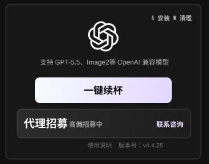
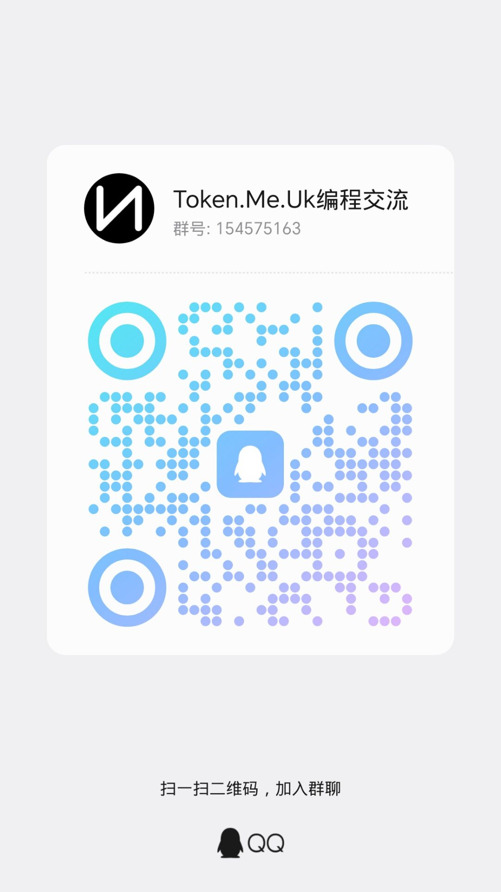

# CodexKey

CodexKey is a desktop bridge for Codex power users. It provides card-key authorization, multi-card management, automatic account rotation, unlimited refill workflows, and OpenAI-compatible model access for GPT-5.5, Image2, and similar models.

CodexKey 是面向 Codex 高频使用场景的本地桌面增强工具。它通过稳定的本地配置写入、卡密授权和账号池调度，让用户在额度耗尽后快速续杯，并在多张卡之间自动切换可用额度，减少重复配置和手动换号。

> This repository is used for product documentation, screenshots, release notes, and installer distribution. Client source code is intentionally not published here.

## Highlights

- **Unlimited refill workflow**: when the current quota is exhausted, CodexKey can continue the session through one-click refill or automatic card/account switching.
- **Multi-card management**: one device can save multiple authorized cards, switch between cards, and display the current card status clearly.
- **Automatic account rotation**: available direct accounts are scheduled from the account pool to keep Codex conversations moving.
- **Local Codex configuration**: CodexKey writes the required local Codex configuration and launches the Codex desktop app after setup.
- **OpenAI-compatible models**: supports GPT-5.5, Image2, and other OpenAI-compatible model endpoints provided by the service.
- **Release-only public repository**: public GitHub releases are used for installer updates while the client source code remains private.

## Download

- Latest version: `v4.4.26`
- Update page: https://github.com/Markovmodcn/CodexKey/releases/latest
- Windows installer: `Codexkey_4.4.26_x64-setup.exe`

## Screenshot

## Usage

1. Install and open CodexKey.
2. Log in with a valid card key.
3. Click one-click refill to write the local Codex configuration.
4. Start or continue using the Codex desktop app.
5. When quota is exhausted, use manual refill or automatic switching to continue with another available card/account.

## Support

Star this repository to follow release updates. For usage support and activity notices, join the QQ group below.

  

  <a href="https://qm.qq.com/q/9DRP6SMeeA"><strong>Join the QQ group</strong></a>

## Notice

Use accounts and model capabilities responsibly. Follow the terms of OpenAI, Codex, and any related upstream services.
