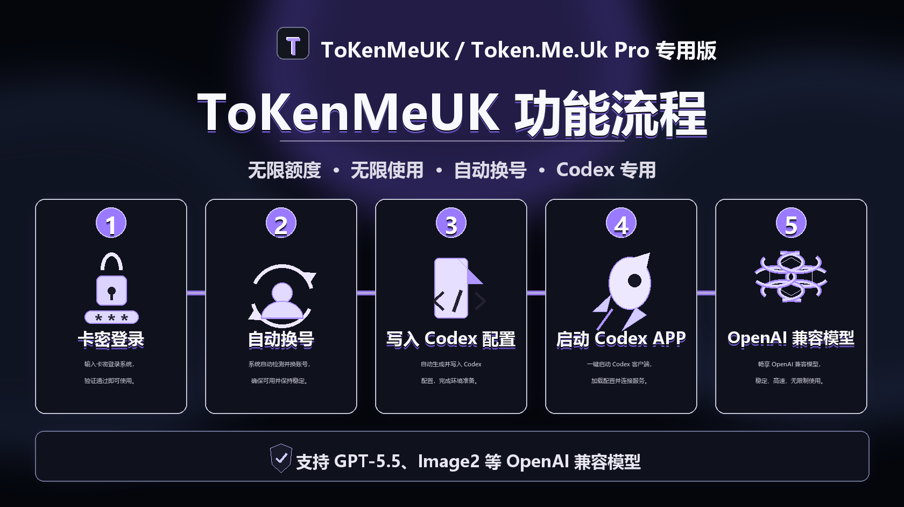

# ToKenMeUK

> Codex 无限额度自动换号工具，支持 GPT-5.5、Image2 等 OpenAI 兼容模型。  
> 面向 Codex 高频用户，主打 **无限使用、自动续杯、本地写入配置、启动 Codex APP**。

## ⭐ Star 收藏福利

> **➕ 点 Star 收藏项目 + 加入 QQ 群，群内不定时送天卡。**  
> 收藏后进群关注公告，后续更新、活动福利、使用支持都会优先同步。

<p align="center">
  <a href="https://qm.qq.com/q/9DRP6SMeeA"><strong>点我直达 QQ 群，领取天卡福利</strong></a>
</p>


## 功能亮点

- **无限额度 / 无限使用**：面向长时间、高频 Codex 工作流设计。
- **自动换号**：一键续杯后自动切换可用通道，减少手动操作。
- **卡密登录**：支持多张卡密保存，一个卡号绑定一台设备，可交替使用。
- **Codex 专用**：只保留 Codex 工具入口，界面更轻、更聚焦。
- **自动写入本地配置**：自动写入 Codex 所需配置，降低使用门槛。
- **自动启动 Codex APP**：换号成功后自动启动 Codex 桌面端。
- **兼容 OpenAI 格式**：支持 GPT-5.5、Image2 等 OpenAI 兼容模型。
- **安装 / 清理能力**：内置 Codex 桌面端安装入口和配置清理入口。

## 功能流程



## 技术架构

ToKenMeUK 的核心思路是本地桥接：客户端负责卡密状态、设备标识、配置写入和 Codex 启动；服务端负责卡密校验、账号池调度和 OpenAI 兼容通道下发。

## 实现细节

- **本地配置写入**：自动生成 Codex 所需的本地配置文件，避免用户手动复制 API 地址和密钥。
- **本地代理通道**：Codex 只连接本机服务，真实账号池地址不会暴露到界面。
- **设备级限制**：卡密与设备标识绑定，支持一机一卡、多卡交替使用。
- **通道调度**：点击一键续杯后，由服务端返回可用通道，本地自动刷新配置。
- **Codex APP 启动**：配置写入后自动拉起 Codex 桌面端，形成完整闭环。
- **配置清理**：支持清理 Codex 本地配置和缓存，方便重新授权或排查异常。

## 请求链路

```text
Codex APP
  -> 本地兼容接口
  -> 卡密与设备标识校验
  -> 账号池通道调度
  -> OpenAI 兼容模型
  -> 流式响应返回 Codex
```

## 使用流程

1. 输入卡密并登录。
2. 软件完成本机授权校验。
3. 点击一键续杯。
4. 自动获取可用通道并写入 Codex 配置。
5. 自动启动 Codex APP。
6. 直接使用 GPT-5.5、Image2 等兼容模型。

## 适用场景

- 长时间使用 Codex 写代码、改项目、跑自动化任务。
- 需要稳定模型通道，不想频繁手动换号。
- 需要通过卡密体系分发 Codex 使用能力。
- 代理批量发卡、续期、售后支持。

## 软件界面

- 黑白苹果风格，窗口紧凑。
- 单工具入口，只服务 Codex。
- 登录后显示当前卡、到期时间和续期入口。
- 安装、清理、代理咨询统一弹窗风格。

## 获取与交流群

欢迎点 Star 收藏项目，加群获取使用说明、更新通知和活动福利。**收藏 + 加群，群内不定时送天卡。**

<p align="center">
  <a href="https://qm.qq.com/q/9DRP6SMeeA">
    
  </a>
</p>

<p align="center">
  <a href="https://qm.qq.com/q/9DRP6SMeeA"><strong>点击直达 QQ 群</strong></a>
</p>

> ⭐ **点 Star 收藏 + 加群，群内不定时送天卡。**

## 说明

本仓库用于 ToKenMeUK 项目展示、功能说明、更新记录和用户支持。请遵守 OpenAI、Codex 及相关服务的使用条款，合理使用账号与模型能力。
