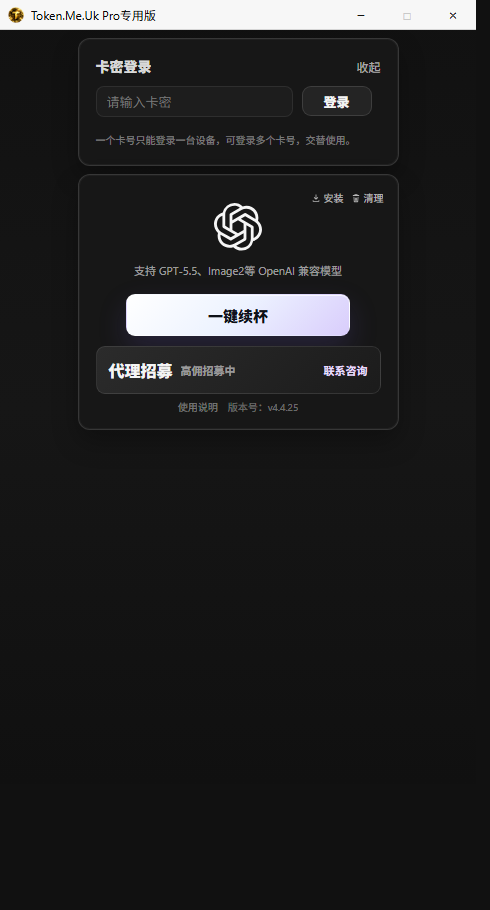
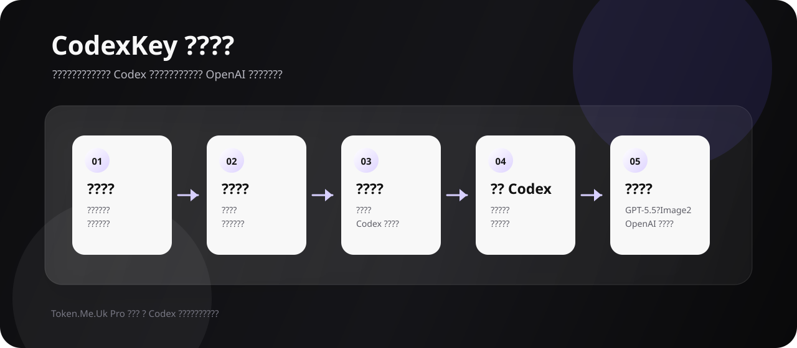

# CodexKey

> Token.Me.Uk Pro 专用版 Codex 工具。主打 **无限额度、无限使用、自动换号**，支持 GPT-5.5、Image2 等 OpenAI 兼容模型。

## 项目说明

CodexKey 是面向 Codex 用户的专业化本地工具展示页。本仓库用于发布软件介绍、功能说明、使用流程与社群入口；当前仓库 **不开放客户端源码**。

软件名称保持为 **Token.Me.Uk Pro 专用版**。产品定位是 Codex 专用卡密授权工具，通过本地配置写入与自动换号能力，让 Codex 使用过程更稳定、更省心。

## 核心能力

- **无限额度使用**：面向高频 Codex 使用场景，降低额度中断影响。
- **自动换号续杯**：点击一键续杯后自动切换可用账号通道。
- **卡密授权登录**：支持多张卡密保存，一个卡号绑定一台设备，可交替使用。
- **本地写入 Codex 配置**：自动写入 Codex 所需本地配置，减少手动配置成本。
- **启动 Codex APP**：换号登录成功后自动启动 Codex 桌面端。
- **OpenAI 兼容模型**：支持 GPT-5.5、Image2 等 OpenAI 兼容模型通道。
- **安装与清理**：内置 Codex 桌面端安装入口和 Codex 配置清理能力。

## 功能流程

1. 输入卡密并完成本机授权。
2. 点击一键续杯，自动请求可用通道。
3. 软件写入 Codex 本地配置。
4. 自动启动 Codex APP。
5. 在 Codex 中使用兼容模型能力。

## 软件界面

- 黑白苹果风格界面，窗口紧凑，适合桌面常驻。
- 仅保留 Codex 单工具入口，不暴露账号池地址。
- 卡密登录后展示当前卡、到期时间与续期入口。
- 代理招募、安装、清理使用统一白底弹窗体验。

## 适用场景

- 需要长期、高频使用 Codex 的个人用户。
- 希望减少手动切换账号和配置文件操作的团队。
- 需要通过卡密体系分发 Codex 使用能力的代理或服务商。

## 获取与支持

软件为非开源发布，客户端源码不在本仓库提供。如需体验、续期或代理合作，请通过 QQ 群联系。

  

  <a href="https://qm.qq.com/q/9DRP6SMeeA"><strong>点击直达 QQ 群</strong></a>

## 声明

本仓库仅用于 CodexKey 软件功能展示与用户支持说明。请遵守 OpenAI、Codex 及相关服务的使用条款，合理使用账号与模型能力。
