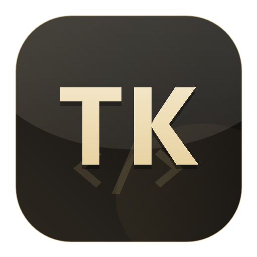

# TokenMe

  

  <strong>AI 续杯助手</strong> 
  Cursor / VS Code / Windsurf / Trae / Codex / cc-switch

  <a href="README.en.md">EN</a> ·
  <a href="https://www.token.me.uk/docs">使用说明</a> ·
  <a href="https://github.com/Markovmodcn/CodexKey/releases/latest">最新版下载</a>

  
  

TokenMe 是给 AI 开发工具准备的本地续杯助手。登录卡密后，一键写入兼容配置；额度耗尽时自动续杯、自动换号，让 Cursor、VS Code、Windsurf、Trae、Codex、cc-switch 等工具继续使用，不需要反复重装开发软件。

## 核心体验

- **无限续杯**：当前账号额度耗尽后，继续接入可用额度，减少中断。
- **多工具支持**：支持 Cursor、VS Code、Windsurf、Trae、Codex、cc-switch 等 AI 开发工具。
- **自动换号**：自动模式下检测到额度耗尽后，自动切换可用账号并重试。
- **一键写入**：自动生成本地 OpenAI 兼容配置，开发工具按检测结果接入。
- **软件内升级**：发现新版本后在软件内自动下载并启动安装器，不需要重新配置开发软件。
- **兼容模型**：支持 GPT-5.5、Image2 等 OpenAI 兼容模型。

## 下载

- 最新版本：`v4.4.30`
- 更新页面：https://github.com/Markovmodcn/CodexKey/releases/latest
- Windows 安装包：`releases/v4.4.30/TokenMe_4.4.30_x64-setup.exe`
- 使用说明：https://www.token.me.uk/docs

## 关键词

TokenMe, CodexKey, Codex Key, Codex 续杯, Cursor 续杯, Windsurf 续杯, Trae 续杯, VS Code AI 续杯, cc-switch 导入, AI 续杯助手, AI 开发工具续杯, OpenAI 兼容模型, 自动换号, 无限续杯, 软件内自动升级。

## 交流

欢迎 Star 收藏项目。版本更新、使用支持和活动通知会同步到交流群。

  

  <a href="https://qm.qq.com/q/9DRP6SMeeA"><strong>加入 QQ 群</strong></a>

